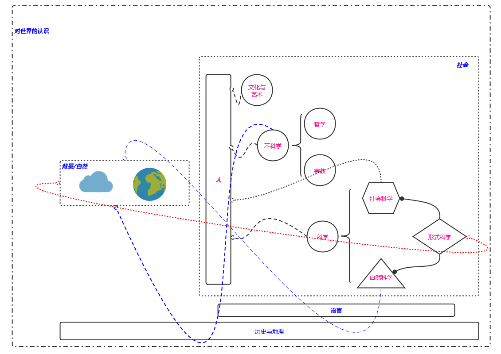

# [中国图书分类法](https://zh.wikipedia.org/zh-cn/%E4%B8%AD%E6%96%87%E5%9C%96%E6%9B%B8%E5%88%86%E9%A1%9E%E6%B3%95#10%E5%80%8B%E5%A4%A7%E5%88%86%E9%A1%9E)
- [数学](形式科学/数学.MD)
- [哲学](哲学/哲学总览.MD)
# 计算机科学
  * [计算机体系结构](computer_science/计算机体系结构.MD)
  * [计算理论与形式语言](computer_science/计算理论、形式语言与复杂性.MD)
  * [操作系统](computer_science/操作系统.MD)
  * [计算机网络与安全技术](computer_science/计算机网络与安全技术.MD)
  * [计算机应用与软件工程](#)
      * [数据库系统原理与实现](computer_science/数据库.MD)
      * [计算机图形学](computer_science/计算机图形学.MD)
      * [WEB应用程序](computer_science/WEB应用程序.MD)
      * [移动应用](#)
      * [软件开发方法论与实践](computer_science/软件工程.MD)
  * [前沿技术](computer_science/前沿技术.MD)
# 如何精通一门编程语言
## I. 形式语言的定式：词法、语法
- 词法元素--字符集
- 类型
- 操作符和表达式
- 语句
- 函数
## II. 基本算法要求
- 字符处理
- 字符串处理
- 数值处理
- 数学函数
- 日期函数
- 内存管理
- I/O工具
## III. 系统级的支持与应用模块化
- 国际化支持
- 数据库编程
- 网络函数
- 图形编程
- 并发编程
- 并行计算
# 认知升级 格物--解耦、解耦、解耦
- 计算理论与形式语言
- POSIX 系统调用
- 操作系统内核
- 网络协议 ISO TCP/IP 信号与通信原理
- 以太网 路由器 互联网-电信网/计算机网络/有线电视网（三网融合）
- 分布式架构--分布式系统各个问题结点与解决方案
- 人工智能领域--深度学习、神经网络与自然语言处理
# 软件开发的本质
    参考wiki： 
    https://zh.wikipedia.org/wiki/软件开发
    https://zh.wikipedia.org/wiki/概念#概念的范围和内容的定义
    
    软件是一种相对于硬件（辩证法）的概念，开发是确定概念的过程，所以软件开发是一个确定软件概念的过程。很像亚里士多德
    逻辑学的三段论，从这个本质意义上形成了各种软件开发方法论与实践(恐怕敏捷开发起源于此)。软件（活动）过程中需求分析与设计、
    软件的测试、调试、部署与维护等以及为完成这一过程而产生的方法与实践构成了软件开发的全部概念。
    
    当我提到这样一些词语你可能会好奇 如果没有可以略过...
    什么是概念？为什么会出现概念？如何定义概念？什么又是什么？什么是是？什么是过程？......
    这些就是哲学家要研究的基本问题的一部分，称之为：世界观（观世界？世界？人永远无法观世界，所以苏格拉底才说人是无知的）
    
    问题的回答：（文->字  古->今  词，文可说 字可解 以词称字 以句辖词 .......）
        概念：在头脑里所形成的反映对象的本质属性的思维形式。
        
        《说文解字》
        什：【卷八】【人部】什 相什保也。从人、十。是執切
        念：【卷十】【心部】念 常思也。从心今聲。奴店切
        是：【卷二】【是部】是 直也。从日正。凡是之屬皆从是。𣆞，籒文是从古文正。承旨切
        
    文/字由认识世界而来  每个字的篆书演变为隶书再到现在的楷书，行书等 文字已经从字有意到字仅有势（现代汉语是简体形式汉语）
    现在汉语是一个词代表一样事物 古汉语是一个字代表一个事物
        
    参考资料：
        规范汉字 https://zh.wikipedia.org/zh-cn/%E8%A7%84%E8%8C%83%E6%B1%89%E5%AD%97
        说文解字（清代陈昌治刻本、清代段玉裁【說文解字注】）
        字源网 http://www.fantiz5.com/ziyuan/
        教育部-语信司-通用规范汉字表 http://www.moe.gov.cn/s78/A19/yxs_left/moe_810/s230/201306/t20130601_186002.html
        词典网 https://www.cidianwang.com/
        语言文字网 http://www.yywzw.com/jt/sj/sj-jt08.htm
# 世界观也论知识
    知识是认识和改变（客观存在的）自然、认识和改变自身的抽象工具，自然的普遍法则是不确定性。    

    
    从上到下从左到右从小到大，人类在历史的长河中，依赖语言的信息传递，逐渐产生文化、艺术、哲学、科学...
    
    背景之外...
    认识背景：
        天地之大德曰生。一阴一阳其生生乎。
        宇宙的起源？时间？
        星系、地球、月球的诞生？    
    认识自然到认识生命：
        地球编年史？ 好似没有地球就没有人类，谁知道呢？
        生命的起源？ 原子分子和单质、无机、有机的元素构成细胞以及蛋白作为RNA、DNA的基础？还是声光热力电比较实在？
        生命的演进？ 
    不足300万年的人类史：
        作为可能是地球食物链顶端的生命
            思想、大脑与中枢神经系统：我能控制构成我的一切原子。一切原子都由一个带正电的原子核和围绕它运动的若干电子组成。
        作为共享自然的社会结构中的个体
            团结就是力量，没有有效的管理就会分化。
        有这么一群人，他们在自然在社会中然而他们意识到他们在自然在社会并努力抛开一切假象探寻真相，我眼中的哲学家。
    
    知识？永远无法逃离的形而上学...
         