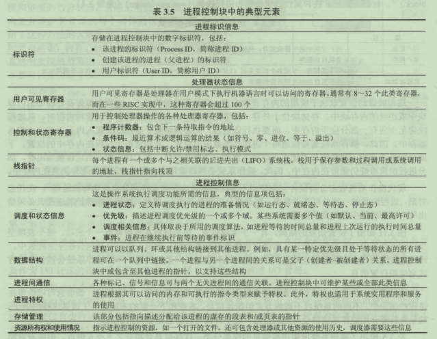

# 进程
## 进程实现（数据结构或者称进程控制块）
  
内核中进程的表示：include/linux/sched.h中[struct task_struct](resource/task_struct简化版.h)  
关于进程相关系统调用接口：[常见系统调用](resource/常见系统调用.png)  
linux中创建（也是复制）进程有3个系统调用：fork,vfork,clone. fork使用了写时复制内存页（Copy-On-Write）技术。  
内核的实现在kernel/fork.c
## 进程调度
## 进程间通信
## 线程
## 参考书籍
* 现代操作系统第4版
* 操作系统精髓与设计原理 第8版
* Unix环境高级编程 第3版
* linux内核设计与实现
* 深入linux内核架构